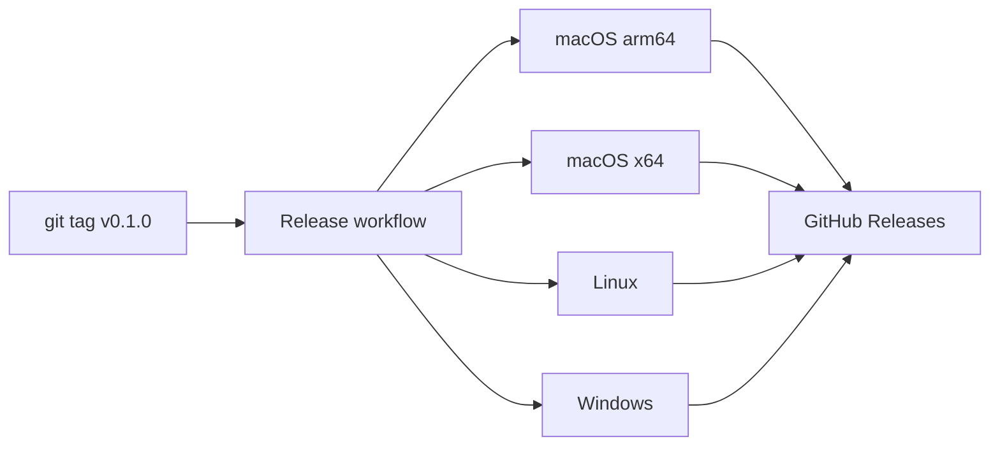

# Mini TestDisk

基于 [Rust](https://www.rust-lang.org/) + [Tauri 2](https://tauri.app/) 的跨平台桌面 GUI，复刻 [cgsecurity/testdisk](https://github.com/cgsecurity/testdisk) 的核心分区分析流程，用于验证技术可行性。

## 功能

- 枚举系统磁盘（macOS / Linux）
- 打开磁盘镜像文件（`.img`、`.iso`、`.dmg` 等）离线分析
- 自动识别 **MBR** / **GPT** 分区表
- GPT 头 CRC32 校验
- 文件系统签名检测：FAT、NTFS、exFAT、ext2/3/4、APFS、HFS/HFS+
- 深度扫描：在 1 MB 边界搜索丢失分区（简化版 Deeper Search）

> 当前为**只读分析**原型，不包含分区写入修复与 PhotoRec 文件雕刻。

## 系统要求

| 依赖 | 版本 |
|------|------|
| Rust | ≥ 1.77（推荐通过 [rustup](https://rustup.rs/) 安装） |
| Tauri CLI | 2.x（`cargo install tauri-cli --locked`） |

### 平台额外依赖

**macOS**

- Xcode Command Line Tools：`xcode-select --install`

**Linux**（Debian/Ubuntu 示例）

```bash
sudo apt update
sudo apt install -y \
  libwebkit2gtk-4.1-dev libayatana-appindicator3-dev \
  librsvg2-dev patchelf build-essential curl wget file libssl-dev
```

**Windows**

- [Microsoft C++ Build Tools](https://visualstudio.microsoft.com/visual-cpp-build-tools/)
- [WebView2](https://developer.microsoft.com/en-us/microsoft-edge/webview2/)（Windows 10/11 通常已内置）

## 快速开始

```bash
# 1. 克隆仓库
git clone <repo-url> testdisk && cd testdisk

# 2. 检查工具链
make check

# 若缺少 Tauri CLI：
make install-tauri-cli

# 3. 生成测试镜像（可选，无需 root）
make sample-image

# 4. 启动开发版 GUI
make dev
```

在 GUI 中：**打开磁盘镜像...** → 选择 `testdata/sample-mbr.img` → **分析分区**。

## 构建

### 当前平台（推荐）

```bash
make build          # Release 安装包
make build-debug    # Debug 版本
make test           # 运行单元测试
make test-core      # 仅核心库测试
make clean          # 清理构建产物
make info           # 查看输出路径
make help           # 所有 Make 目标
```

### 跨平台构建说明

Tauri 原生 GUI 需在**目标操作系统上**构建安装包：

| 目标平台 | 命令 | 输出格式 |
|----------|------|----------|
| macOS | `make build-macos` | `.app`、`.dmg` |
| Linux | `make build-linux` | `.deb`、`.AppImage` |
| Windows | `make build-windows` | `.exe`、`.msi` |

构建完成后，产物位于：

```
target/release/bundle/
├── macos/          # Mini TestDisk.app
├── dmg/            # Mini TestDisk_*.dmg
├── deb/            # *.deb
├── appimage/       # *.AppImage
├── msi/            # *.msi
└── nsis/           # *.exe
```

在 CI 中可分别为三个 OS 各跑一条 `make build-*` 流水线，实现跨平台发布。

### GitHub Actions 自动发布

仓库已配置 CI/CD 工作流：

| 工作流 | 触发条件 | 说明 |
|--------|----------|------|
| [CI](.github/workflows/ci.yml) | push / PR → `main` | 单元测试 + Linux 编译验证 |
| [Release](.github/workflows/release.yml) | 推送 tag `v*` 或手动触发 | 四端并行打包并发布到 GitHub Releases |

**发布新版本：**

```bash
# 1. 更新 src-tauri/tauri.conf.json 中的 version
# 2. 提交并打 tag
git tag v0.1.0
git push origin v0.1.0
```

或在 GitHub 网页：**Actions → Release → Run workflow**，填写 tag（如 `v0.1.0`）。

Release 工作流会在以下 Runner 上并行构建：

- macOS Apple Silicon (`aarch64-apple-darwin`) → `.dmg`
- macOS Intel (`x86_64-apple-darwin`) → `.dmg`
- Ubuntu 22.04 → `.deb`、`.AppImage`
- Windows → `.msi`、`.exe`

**首次使用前**，在仓库 **Settings → Actions → General → Workflow permissions** 中开启 **Read and write permissions**，否则上传 Release 会失败。



## 项目结构

```
testdisk/
├── .github/workflows/       # CI / Release 工作流
│   ├── ci.yml
│   └── release.yml
├── Makefile                 # 跨平台构建入口
├── README.md
├── Cargo.toml               # Workspace 根
├── crates/
│   └── testdisk-core/       # 核心库（分区表 + 文件系统检测）
│       ├── disk.rs
│       ├── mbr.rs
│       ├── gpt.rs
│       ├── fs_detect.rs
│       └── scanner.rs
├── src-tauri/               # Tauri 后端（IPC 命令）
│   ├── src/lib.rs
│   └── tauri.conf.json
├── ui/                      # 前端（HTML / CSS / JS）
│   ├── index.html
│   ├── styles.css
│   └── main.js
└── testdata/
    └── sample-mbr.img       # make sample-image 生成
```

## 架构

```
┌─────────────────────────────────────┐
│  ui/          Tauri WebView 前端     │
└──────────────┬──────────────────────┘
               │ invoke (IPC)
┌──────────────▼──────────────────────┐
│  src-tauri/   Tauri 命令层           │
│  get_disks / scan_disk_path / ...   │
└──────────────┬──────────────────────┘
               │
┌──────────────▼──────────────────────┐
│  testdisk-core/  纯 Rust 核心库      │
│  MBR · GPT · FS 检测 · 深度扫描      │
└──────────────┬──────────────────────┘
               │ 只读
┌──────────────▼──────────────────────┐
│  块设备 /dev/disk*  或  磁盘镜像      │
└─────────────────────────────────────┘
```

## 权限说明

- **磁盘镜像**：普通用户即可读写分析。
- **物理磁盘**（如 `/dev/disk0`）：macOS / Linux 通常需要 root 权限：

  ```bash
  # macOS 示例（谨慎操作，只读打开）
  sudo make dev
  ```

## 与原版 TestDisk 对比

| 能力 | 原版 TestDisk | Mini TestDisk |
|------|---------------|---------------|
| MBR / GPT 解析 | ✅ | ✅ |
| 文件系统签名检测 | 30+ 种 | 8 种（常见） |
| 丢失分区深度搜索 | ✅ 完整 | ✅ 简化 |
| 分区表修复写入 | ✅ | ❌ 未实现 |
| PhotoRec 文件雕刻 | ✅ | ❌ 未实现 |
| 跨平台 GUI | ncurses TUI | Tauri 原生窗口 |

## 许可证

核心思路参考 [cgsecurity/testdisk](https://github.com/cgsecurity/testdisk)（GPL-2.0）。本项目代码请根据实际需要自行选择许可证。

## 参考

- [TestDisk 官方文档](https://www.cgsecurity.org/wiki/TestDisk)
- [TestDisk GitHub](https://github.com/cgsecurity/testdisk)
- [Tauri 文档](https://tauri.app/start/)
